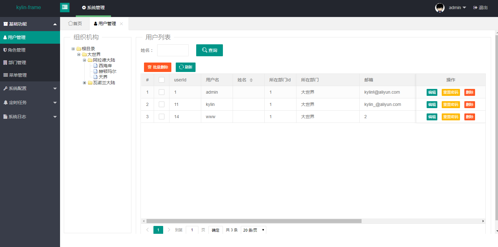
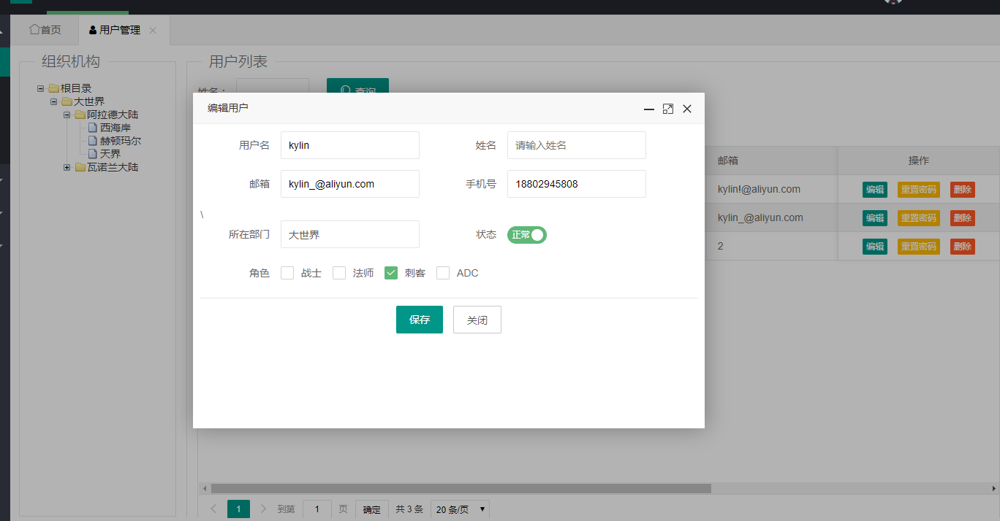
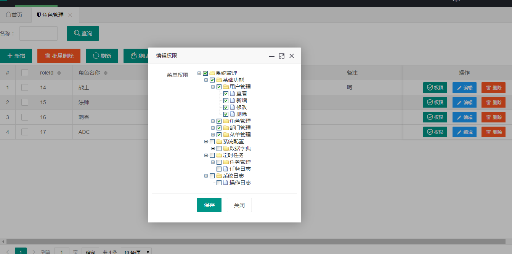
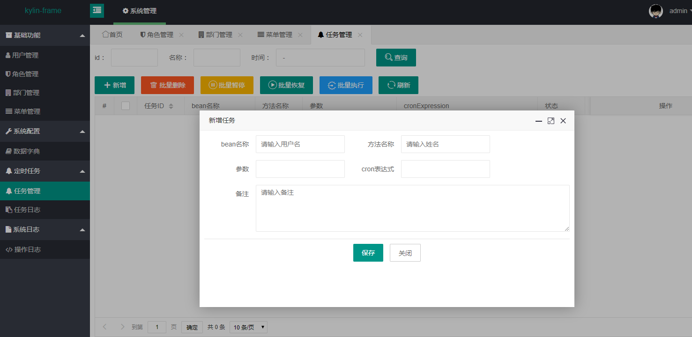

## 平台简介
kylin-frame快速开发平台是一款小而美的快速开发平台。平台内置 用户管理、部门管理、角色管理、菜单管理、日志管理、数据源监控、定时任务 等功能。

## 具有如下特点
- 友好的代码结构及注释，便于阅读及二次开发
- 灵活的权限控制，可控制到页面或按钮，满足绝大部分的权限需求
- 使用quartz定时任务，可动态完成任务的添加、修改、删除、暂停、恢复、运行日志查看功能
- 页面使用layui，封装了常用组件，不必再写一堆重复的js，只需在html页面简单配置
- 使用Hibernate Validator校验框架，轻松实现后端校验

## 如何交流、反馈、参与贡献？
- Git仓库：https://gitee.com/bestkylin/kylin-frame
- QQ交流群：748069908
- 如需关注项目最新动态，请Watch、Star项目

## 技术选型：
- 核心框架：Spring Boot 2.0.0 RELEASE
- 安全框架：Apache Shiro 1.4
- 持久层框架：MyBatis 3.4.5
- 定时器：Quartz 2.3
- 数据库连接池：Druid 1.1.3
- 日志管理：SLF4J 1.7、Log4j
- 页面：layui

## 本地部署
- 通过git下载源码
- 创建数据库kylin-frame，数据库编码为UTF-8
- 执行doc/db.sql文件，初始化数据
- 修改application-dev.yml，更新MySQL账号和密码
- 项目访问路径：http://localhost:8080/kylin-frame
- 账号密码：admin/admin

## 效果图

!
